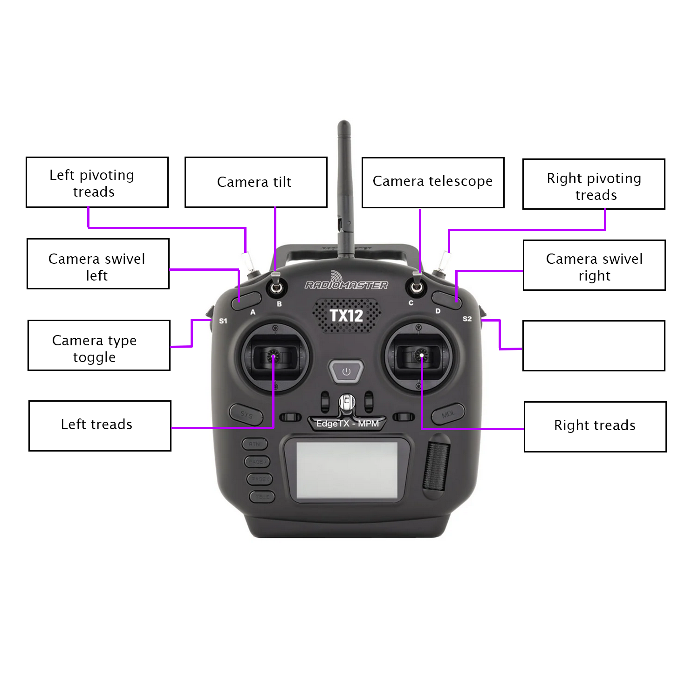

---

# W.A.R.D.E.N. -- COMET 2024
Wireless Assessment Rover with Drone Extended Network

 

https://github.com/njii-comet-2024/WARDEN

---

## Description

This repository holds the control code for the COMET 2024 internship project. 

The project, called W.A.R.D.E.N., is a deployable field recon system. It is comprised of a ground rover and aerial vehicle. The objective of the aerial vehicle is to extend the communication range of the ground rover for recon.

This project is still a work in progress. 

---

## Definitions

**Rover:** The ground vehicle used for reconnaissance.

**Drone:** The air vehicle used to extend the rover's range.

**Central:** The Raspberry Pi used to receive video footage from both vehicles.

**Rover Control:** The controller used to transmit movement controls to the rover.

**Drone Control:** The controller used to transmit movement controls to the drone.

**Ground Station:** Refers to all command controllers and receivers and Wi-Fi network-- Lcentral, rover control, drone control, and router.

---

## Controller Components

**Central Raspberry Pi:** Runs programs `centralToRover.py` and `centralServer.py` to send controls to and receive video from Rover Raspberry Pi and receive video from Drone VTX.

**Rover Raspberry Pi:** Runs program `roverToCentral.py` to receive controls from Central Raspberry Pi and runs them on rover.

**Drone VTX:** Transmits drone video at a specific frequency for Central Raspberry Pi to receive.

---

## Goals

- Communicate with both the ground and air vehicles to control them.
- Receive video feed from both the ground and air vehicles.
- Extend the Wi-Fi range using the drone after the rover has lost connection.

---

## Changelog

Major changes will be documented in the . These changes will be tagged as a new version.

---

## Standards

### Comments

Multi-line comments at the beginning of every function explaining what it does, the return value, and any parameters.

Multi-line comments at the beginning of every class detailing the class's purpose, the author(s), and date last updated.

Single line comment before any complex code blocks.

**Tags**

- @author `author name`: `author github username`
- @param \``param name`\`: `param description`
- @return \``variable name`\`: `variable description`

### Naming Conventions

Variables, functions, and classes should be named using camel case (e.g. camelCase).
