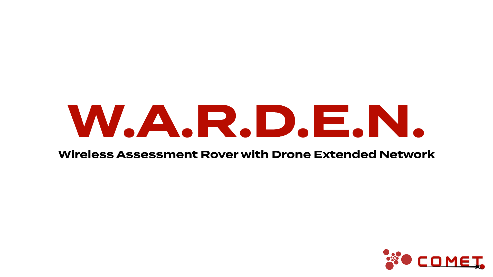
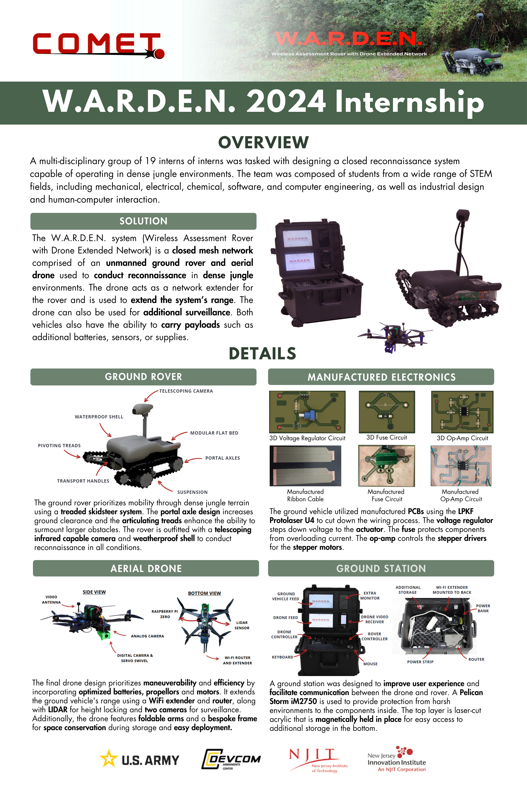
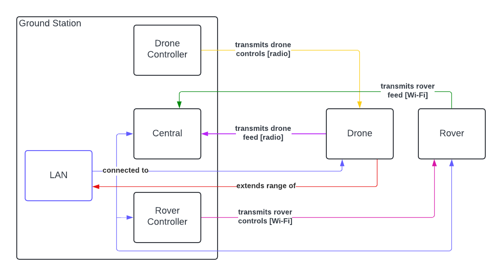

---

# NJII COMET Summer/Fall 2024 Internship Project

Click  to view the full in-depth project report presentation from research to final designs.

---

## Contents

[Description](#description)

[Goals](#goals)

[Definitions](#definitions)

[Controller Components](#controller-components)

[Necessary Libraries](#necessary-libraries)

[Changelog](#changelog)

[Standards](#standards)

[Project Progress](#project-progress)

---

## Description

This repository holds the control and communication code for the COMET 2024 internship project. This is an ongoing project.

The project, called W.A.R.D.E.N., is a deployable field recon system. It is comprised of a ground rover and aerial vehicle. The objective of the aerial vehicle is to extend the communication range of the ground rover for recon.

---

## Goals

- Communicate with both the drone and rover to control them.
- Receive video feed from both the drone and rover.
- Extend the Wi-Fi range using the drone after the rover has lost connection.

---

## Definitions

**Rover:** The ground vehicle used for reconnaissance.

**Drone:** The aerial vehicle used to extend the rover's range.

**Central:** The Raspberry Pi used to receive video footage from both vehicles and display video footage and necessary feedback.

**Rover Control:** The controller used to transmit movement controls to the rover.

**Drone Control:** The controller used to transmit movement controls to the drone.

**Ground Station:** Refers to all command controllers and receivers and Wi-Fi network-- Central, rover control, drone control, and router.

---

## Controller Components

**Central Raspberry Pi** *(Raspberry Pi 4)*

Runs programs `roverFeed.py` to receive rover video from ~~Camera Raspberry Pi~~ Camera Jetson, `centralToRover.py` to send controls to Controls Raspberry Pi, `droneFeed.py` to receive drone video from Drone Raspberry Pi, and `analogDroneFeed.py` to receive analog drone video from Drone VTX. Also used to SSH into ~~Camera Raspberry Pi~~ Camera Jetson to run `roverToCentral.py`.

~~**Controls Arduino**  *(Arduino Uno)*~~

~~Runs program `roverControls.py` to receive controls from Central Raspberry Pi and run them on rover.~~ 

*Replaced with Raspberry Pi*

**Controls Raspberry Pi**  *(Raspberry Pi 4)*

Runs program `roverControls.py` to receive controls from Central Raspberry Pi and run them on rover.

~~**Camera Raspberry Pi:**  *(Raspberry Pi 4)*~~

~~Runs program `roverToCentral.py` to receive camera positions from Central Raspberry Pi and send rover back video to Central Raspberry Pi.~~ 

*Replaced with NVIDIA Jetson Orin Nano.*

**Camera Jetson**  *(NVIDIA Jetson Orin Nano)*

Runs program `roverToCentral.py` to receive camera positions from Central Raspberry Pi and send rover back video to Central Raspberry Pi.

**Drone Raspberry Pi**  *(Raspberry Pi Zero 2 W)*

Runs `droneToCentral.py` to transmit digital drone video to Central Raspberry Pi.

**Drone VTX** *[Rush Tank VTX 2.5w](https://www.amazon.com/Transmitter-Shell-Range-MultiRotor-Racing/dp/B0BRMMLVR2?crid=2CTFRSN8RZNY0&dib=eyJ2IjoiMSJ9.Ep95uNd_KIHQ_NfudOZkjacavk7IkO_HMLPncmSX4hPKJ7Htd1LIK6H60x-WQMAeLTqYsmTw-XttnXRyoeSBf7geDy-LK4m_Ot7ZY2xFTCmQStFHR1gcZK11FN3HuXEgWWCtCvLa-8XcAixjIzq05hXqyFlu579TaomtrKd2cAn0pWcRIo_2wtbg_gsOlwL5Lc7x0el0ZRvYCgYxnk1uQhFR9Y4B7VhYjrmgjpxs0zaKD-AAqNF5AVHNj0A6pspWuaGRUK2ncWSxe_jBvZKSVhbM2KBv1PThUY9bGBp_F8I.aXfZaHTuSs1NUDGYdNQBMw6FXfqc_P9ZIj2S3TazcPQ&dib_tag=se&keywords=rush+tank+solo&qid=1719510570&sprefix=rush+tank+solo%2Caps%2C142&sr=8-1)*

Transmits analog drone video to Central Raspberry Pi.

### The Switch to NVIDIA Jetson
The Camera Raspberry Pi was replaced with an NVIDIA Jetson Orin Nano to implement real-time object detection.

All Raspberry Pi programs are saved in this [folder](src/rover/raspi_cam_archive).

---

## Necessary Libraries

- [OpenCV](https://opencv.org/get-started/)
- [cvzone](https://pypi.org/project/cvzone/)
- [pygame](https://www.pygame.org/news)
- ~~[picamera and picamera[array]](https://picamera.readthedocs.io/en/release-1.13/install.html)~~ Only used with Raspberry Pi
- [RPI.GPIO](https://pypi.org/project/RPi.GPIO/)

Used with NVIDIA Jetson Orin Nano:
- [jetson-utils](https://github.com/dusty-nv/jetson-utils)
- [jetson-inference](https://github.com/dusty-nv/jetson-inference)

---

## Changelog

Major changes will be documented in the . These changes will be tagged as a new version.

Current Version: v1.1.0

---

## Standards

### Comments

Multi-line comments at the beginning of every function explaining what it does, the return value, and any parameters.

Multi-line comments at the beginning of every class detailing the class's purpose, the author(s), and date last updated.

Single line comment before any complex code blocks.

**Tags**

- @author `author name`: `author github username`
- @param \``param name`\`: `param description`
- @return \``variable name`\`: `variable description`

### Naming Conventions

Variables, functions, and classes should be named using camel case (e.g. camelCase).

---

## Project Progress

This project is ongoing since June 2024. Currently, all of the basic goals have been met and the system is fully functioning.

Ongoing and future changes surround the rover camera. The Camera Raspberry Pi has been swapped out with an NVIDIA Jetson Orin Nano to implement object detection and, in the future, possibly autonomy or semi-autonomy.