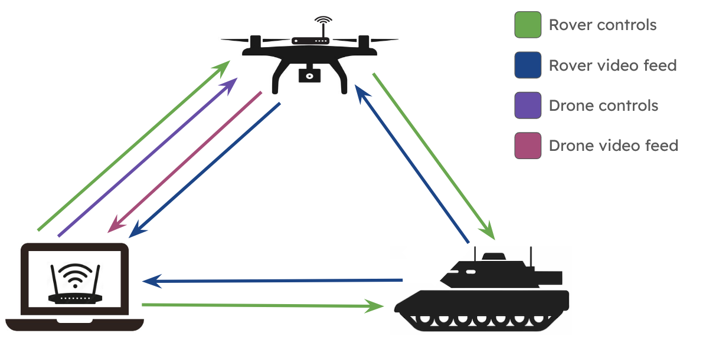

[](https://pypi.org/project/cookiecutter/)
[](https://choosealicense.com/licenses/)


---


# NJII COMET Summer/Fall 2024 Internship Project

Click  to view the full in-depth project report presentation from research to final designs.

---

## Contents

[Description](#description)

[Goals](#goals)

[Definitions](#definitions)

[Main Programs](#main-programs)

[Controller Components](#controller-components)

[Necessary Libraries](#necessary-libraries)

[Changelog](#changelog)

[Standards](#standards)

[NVIDIA Jetson Orin Nano Setup](#setting-up-nvidia-jetson-orin-nano)

[Project Progress](#project-progress)

---

## Description

This repository holds the control and communication code for the COMET 2024 internship project. This is an ongoing project.

For COMET W.A.R.D.E.N. setup instructions, check the sharepoint.

The project, called W.A.R.D.E.N., is a deployable field recon system. It is comprised of a ground rover and aerial vehicle. The objective of the aerial vehicle is to extend the communication range of the ground rover for recon.





---

## Goals

- Communicate with both the drone and rover to control them.
- Receive video feed from both the drone and rover.
- Extend the Wi-Fi range using the drone after the rover has lost connection.

---

## Definitions

**Rover:** The ground vehicle used for reconnaissance.


**Drone:** The aerial vehicle used to extend the rover's range.


**Central:** The Raspberry Pi used to receive video footage from both vehicles and display video footage and necessary feedback.


**Rover Control:** The controller used to transmit movement controls to the rover.


**Drone Control:** The controller used to transmit movement controls to the drone.


**Ground Station:** Refers to all command controllers and receivers and Wi-Fi network-- Central, rover control, drone control, and router.

---

## Main Programs

### Rover

#### `roverControls.py`

Receives controls from central and controls motors/servos on rover

#### `roverDetectNet.py`

Runs the camera via `JetsonCamera.py` and overlays GUI and generic object detections before sending frames to central \
*Run via SSH from central*

#### `roverPlantNet.py`

Runs the camera via `PlantClassification.py` and overlays GUI and plant classification before sending frames to central \
*Run via SSH from central*

### Drone

#### `droneToCentral.py`

Runs the camera and sends frames to central

### Central

#### `droneFeed.py`

Receives frames from drone and displays them

#### `roverFeed.py`

Receives frames from rover and displays them 

#### `centralToRover.py`

Detects controller input and transmits it to rover

---

## Controller Components

**Central Raspberry Pi** *(Raspberry Pi 4)*\
Runs programs `roverFeed.py` to receive rover video from ~~Camera Raspberry Pi~~ Camera Jetson, `centralToRover.py` to send controls to Controls Raspberry Pi, `droneFeed.py` to receive drone video from Drone Raspberry Pi, and `analogDroneFeed.py` to receive analog drone video from Drone VTX. Also used to SSH into ~~Camera Raspberry Pi~~ Camera Jetson to run `roverToCentral.py`.

~~**Controls Arduino**  *(Arduino Uno)*~~ *Replaced with Raspberry Pi*\
~~Runs program `roverControls.ino` to receive controls from Central Raspberry Pi and run them on rover.~~ 

**Controls Raspberry Pi**  *(Raspberry Pi 4)*\
Runs program `roverControls.py` to receive controls from Central Raspberry Pi and run them on rover.

~~**Camera Raspberry Pi:**  *(Raspberry Pi 4)*~~ *Replaced with NVIDIA Jetson.*\
~~Runs program `roverToCentral.py` to receive camera positions from Central Raspberry Pi and send rover back video to Central Raspberry Pi.~~ 

**Camera Jetson**  *(NVIDIA Jetson Orin Nano)*\
Runs program `roverDetectNet.py` or `roverPlantNet.py` to receive camera positions from Central and send rover back video to Central Raspberry Pi.

**Drone Raspberry Pi**  *(Raspberry Pi Zero 2 W)*\
Runs `droneToCentral.py` to transmit digital drone video to Central Raspberry Pi.

**Drone VTX** *([Rush Tank VTX 2.5w](https://www.amazon.com/Transmitter-Shell-Range-MultiRotor-Racing/dp/B0BRMMLVR2?crid=2CTFRSN8RZNY0&dib=eyJ2IjoiMSJ9.Ep95uNd_KIHQ_NfudOZkjacavk7IkO_HMLPncmSX4hPKJ7Htd1LIK6H60x-WQMAeLTqYsmTw-XttnXRyoeSBf7geDy-LK4m_Ot7ZY2xFTCmQStFHR1gcZK11FN3HuXEgWWCtCvLa-8XcAixjIzq05hXqyFlu579TaomtrKd2cAn0pWcRIo_2wtbg_gsOlwL5Lc7x0el0ZRvYCgYxnk1uQhFR9Y4B7VhYjrmgjpxs0zaKD-AAqNF5AVHNj0A6pspWuaGRUK2ncWSxe_jBvZKSVhbM2KBv1PThUY9bGBp_F8I.aXfZaHTuSs1NUDGYdNQBMw6FXfqc_P9ZIj2S3TazcPQ&dib_tag=se&keywords=rush+tank+solo&qid=1719510570&sprefix=rush+tank+solo%2Caps%2C142&sr=8-1))*\
Transmits analog drone video to Central Raspberry Pi.


### The Switch to NVIDIA Jetson
The Camera Raspberry Pi was replaced with an NVIDIA Jetson Orin Nano to implement real-time object detection.\
All Raspberry Pi programs are saved in this [folder](src/rover/raspi_cam_archive).\
Orin Nano setup information can be found [here](#setting-up-nvidia-jetson-orin-nano).

---

## Necessary Libraries

- [OpenCV](https://opencv.org/get-started/)
- [cvzone](https://pypi.org/project/cvzone/)
- [pygame](https://www.pygame.org/news)
- ~~[picamera and picamera[array]](https://picamera.readthedocs.io/en/release-1.13/install.html)~~ Only used with Raspberry Pi
- [RPI.GPIO](https://pypi.org/project/RPi.GPIO/)

Used with NVIDIA Jetson Orin Nano:
- [jetson-utils](https://github.com/dusty-nv/jetson-utils)
- [jetson-inference](https://github.com/dusty-nv/jetson-inference)

---

## Changelog

Major changes will be documented in the . These changes will be tagged as a new version.

Current Version: [v1.2.0](https://github.com/njii-comet-2024/WARDEN/releases/tag/v1.2.0)

---

## Standards

### Comments

Multi-line comments at the beginning of every function explaining what it does, the return value, and any parameters.


Multi-line comments at the beginning of every class detailing the class's purpose, the author(s), and date last updated.


Single line comment before any complex code blocks.


**Tags**

- @author `author name`: `author github username`
- @param \``param name`\`: `param description`
- @return \``variable name`\`: `variable description`

### Naming Conventions

Variables, functions, and classes should be named using camel case (e.g. camelCase).

---

## Setting Up NVIDIA Jetson Orin Nano

NVIDIA Jetson Nanos can be a bit complicated to set up.

To flash a new Orin Nano, follow [this tutorial](https://developer.nvidia.com/embedded/learn/jetson-orin-nano-devkit-user-guide/software_setup.html). It requires a host machine that runs Ubuntu.\
Any other set-up issues can be resolved by searching through [this guide](https://developer.nvidia.com/embedded/learn/get-started-jetson-orin-nano-devkit).

### Camera Initialization

Jetsons can be very picky with supported cameras. For Orin Nanos, many USB webcams are plug-and-play compatible. However, not many CSI cameras are plug-and-play since it can only support certain camera sensors. View [this list](https://developer.nvidia.com/embedded/jetson-partner-supported-cameras?t-1_supported-jetson-products=Orin) to see which cameras are compatible. Currently, this project uses an [Arducam B016712MP](https://www.uctronics.com/arducam-12mp-pan-tilt-zoom-ptz-camera-for-raspberry-pi-and-jetson-nano-b016712mp.html) (which uses an IMX477 sensor).

#### Arducam IMX477 Driver

Check the [Arducam MIPI GitHub](https://github.com/ArduCAM/MIPI_Camera/releases) or official drivers. Make sure to download the driver that is compatible with the version of JetPack the Jetson is running. Currently, only JetPack versions up to 5.15 are supported on that list.

For JetPack 6, use [this driver](https://drive.google.com/file/d/1gqm25pW37vRDFeogCUQRs3GYsN5l7CZl/view).

Run the following command to install the downloaded driver:

```sh
sudo dpkg -i <DRIVER_PATH>
```

### OpenCV

OpenCV needs to be built with GStreamer and GTK+ enabled.

Steps to install and build OpenCV for this project on Orin Nano:

1. Download and install OpenCV:

```sh
cd ~
wget -O opencv.zip https://github.com/opencv/opencv/archive/refs/heads/master.zip
unzip opencv.zip
cd opencv-master
```

2. Install dependencies for GTK+ and GStreamer:

```sh
sudo apt-get update
sudo apt-get install cmake g++ wget unzip
sudo apt-get install libopencv-dev gstreamer1.0-tools gstreamer1.0-plugins-base
sudo apt-get install -y libgstreamer1.0-dev libgstreamer-plugins-base1.0-dev libgstreamer-plugins-good1.0-dev libgstreamer-plugins-bad1.0-dev libgstreamer-plugins-ugly1.0-dev
sudo apt-get install -y libgtk2.0-dev libgtk-3-dev libcanberra-gtk3-dev pkg-config
sudo apt-get install -y libavcodec-dev libavformat-dev libavutil-dev libswscale-dev libavresample-dev
sudo apt-get install --quiet -y --no-install-recommends gstreamer1.0-gl gstreamer1.0-opencv gstreamer1.0-plugins-bad gstreamer1.0-plugins-good gstreamer1.0-plugins-ugly libgstreamer1.0-0
sudo apt install libgstrtspserver-1.0-0
sudo apt install ubuntu-restricted-extras
sudo apt-get install gstreamer1.0*
```

3. Ensure GStreamer path is accessible:

```sh
echo $LD_LIBRARY_PATH
```

You should see paths like `/usr/local/lib` or `/usr/lib/gstreamer-1.0/` in the output.

Repeat this process with the following two commands to check the paths for CMake:

```sh
echo $PKG_CONFIG_PATH 
```

```sh
echo $CMAKE_PREFIX_PATH 
```

If any of these paths do not output as expected, you will need to add LD_LIBRARY_PATH, PKG_CONFIG_PATH, and/or CMAKE_PREFIX_PATH to the shell profile file:

```sh
nano ~/.bashrc
```

Add the following lines to the end of the file as needed:

```bashrc
export LD_LIBRARY_PATH=/usr/local/lib:/usr/lib/gstreamer-1.0:$LD_LIBRARY_PATH
export PKG_CONFIG_PATH=/usr/lib/aarch64-linux-gnu/pkgconfig:/usr/local/lib/pkgconfig:$PKG_CONFIG_PATH
export CMAKE_PREFIX_PATH=/usr/lib/aarch64-linux-gnu:$CMAKE_PREFIX_PATH
```

Apply the changes:

```sh
source ~/.bashrc
```

Confirm the changes were successful:

```sh
echo $LD_LIBRARY_PATH
echo $CMAKE_PREFIX_PATH 
echo $PKG_CONFIG_PATH 
```

4. Clean (if already exists) and create your build directory:

```sh
cd ~/opencv-master
rm -rf build
mkdir build
cd build
```

5. Configure the build with GTK+ and GStreamer enabled:

```sh
cmake -D WITH_GSTREAMER=ON \
      -D WITH_QT=OFF \
      -D WITH_GTK=ON \
      -D WITH_FFMPEG=ON \
      -D CMAKE_BUILD_TYPE=Release \
      -D CMAKE_INSTALL_PREFIX=/usr/local ..
```

6. Build and install OpenCV:

```sh
make -j4
sudo make install
```

7. Verify installation:

```sh
python3 -c "import cv2; print(cv2.getBuildInformation())"
```

Look for GTK+ and GStreamer. Both should show they are enabled by specifying "ON"

### GStreamer Pipeline

The rover camera's GStreamer pipeline heaily depends on the type of camera -- specifically the camera sensor. Pixelformat needs to be set to the correct format based on sensor, which determines what source is used to capture frames (nvargcamerasrc, v4l2, etc).

To figure out pixelformat:

```sh
v4l2-ctl --list-devices
```

This will show what port the camera is on (e.g. /dev/video0).

```sh
v4l2-ctl --device=<PORT> --list-formats-ext
```

This will show the camera's pixelformat along with what resolution (capture_width, capture_height) matches which framerate.

Arducam B016712MP output:

```sh
ioctl: VIDIOC_ENUM_FMT
    Type: Video Capture

    [0]: 'RG10' (10-bit Bayer RGRG/GBGB)
        Size: Discrete 4032x3040
            Interval: Discrete 0.048s (21.000 fps)
        Size: Discrete 3840x2160
            Interval: Discrete 0.033s (30.000 fps)
        Size: Discrete 1920x1080
            Interval: Discrete 0.017s (60.000 fps)
```

Based on the above output, pixelformat is RG10 and resolution should be 4032x3040 at 21fps.

> [!WARNING]
> Currently the pipeline is configured for 21 fps and a resolution of 1920x1080. This is not correct, however, there is an issue with the specific camera this project uses with screen tearing. A *lot* of debugging has happened to remove the screen tearing, but it is only mitigated by mismatching framerate and resolution. This is incredibly incorrect, but given the time frame for this project, it is an acceptable solution.

GStreamer pipeline for Arducam B016712MP:

```python
def gstreamer_pipeline(
    capture_width=1920,
    capture_height=1080,
    display_width=840,
    display_height=560,
    framerate=21,
    flip_method=0,
):
    return (
        "nvarguscamerasrc ! "
        "video/x-raw(memory:NVMM), "
        f"width=(int){capture_width}, height=(int){capture_height}, "
        f"pixelformat=RG10, framerate=(fraction){framerate}/1 ! "
        "queue max-size-buffers=2 leaky=upstream ! "
        f"nvvidconv flip-method={flip_method} ! "
        f"video/x-raw, width=(int){display_width}, height=(int){display_height}, format=(string)BGRx ! "
        "videoconvert ! "
        "video/x-raw, format=(string)BGR ! appsink"
    )
```

---

## Project Progress

This project is ongoing since June 2024. Currently, all of the basic goals have been met and the system is fully functioning.

Ongoing and future changes surround the rover camera. The Camera Raspberry Pi has been swapped out with an NVIDIA Jetson Orin Nano to implement object detection classification. Currently, object detection using detectNet with ssd-mobilenet-v2 and plant classification using PlantNet-300K with resnet18 are fully implemented. Work is ongoing to implement a biodiversity mapping system using the plant classification program, currently using IP address to get location, but eventually switching to a GPS module for better accuracy.

Last updated 11/21/2024